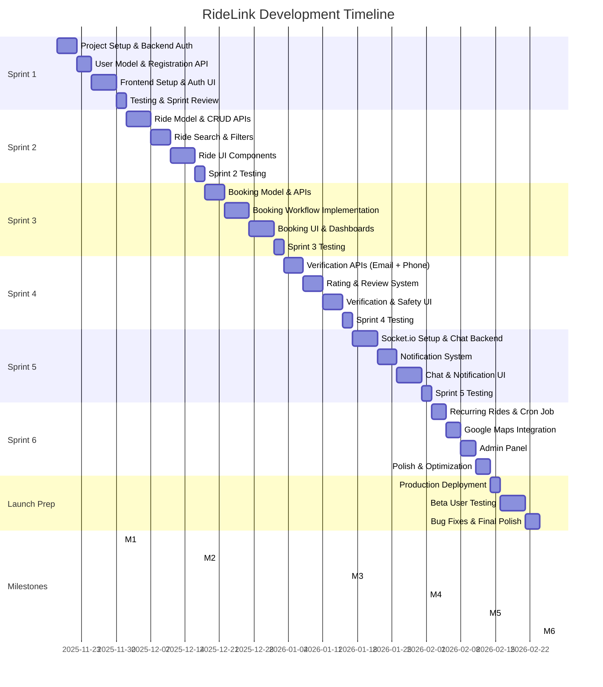

# Development Timeline: RideLink

## Document Information

- **Project**: RideLink - University Carpooling Platform
- **Version**: 1.0
- **Author**: Project Manager Agent
- **Date**: November 13, 2025
- **Timeline**: 12 weeks (November 18, 2025 - February 9, 2026)

---

## Overview

This timeline assumes a **solo full-stack developer** working **10-15 hours per week**. The project is divided into **6 two-week sprints** with built-in buffer time for unexpected issues.

**Key Dates**:

- **Start Date**: November 18, 2025 (Monday)
- **MVP Complete**: February 2, 2026 (Week 11 end)
- **Beta Testing**: February 2-9, 2026 (Week 12)
- **Public Launch**: February 10, 2026 (Target)

---

## Gantt Chart

---

## Week-by-Week Breakdown

### Week 1: Nov 18-24, 2025 (Sprint 1.1)

**Focus**: Project Setup & Backend Foundation

| Day         | Tasks              | Hours | Deliverables                       |
| ----------- | ------------------ | ----- | ---------------------------------- |
| **Mon**     | TASK-001, TASK-002 | 4h    | Express server + MongoDB connected |
| **Tue**     | TASK-003, TASK-004 | 5h    | User model + registration endpoint |
| **Wed**     | TASK-005, TASK-006 | 5h    | Login endpoint + JWT middleware    |
| **Thu**     | TASK-008, TASK-009 | 4h    | React app + routing setup          |
| **Fri-Sun** | Buffer time        | -     | Catch up if needed                 |

**Weekly Goal**: Backend auth working, frontend scaffolded  
**Estimated**: 18 hours | **Critical Path**: Yes

---

### Week 2: Nov 25-Dec 1, 2025 (Sprint 1.2)

**Focus**: Authentication UI & Sprint 1 Completion

| Day     | Tasks               | Hours | Deliverables                      |
| ------- | ------------------- | ----- | --------------------------------- |
| **Mon** | TASK-010, TASK-011  | 5h    | Auth context + registration form  |
| **Tue** | TASK-012            | 3h    | Login page UI                     |
| **Wed** | TASK-013            | 3h    | Dashboard layout                  |
| **Thu** | TASK-007, testing   | 3h    | Rate limiting + integration tests |
| **Fri** | Sprint review, docs | 2h    | Demo video, retrospective         |

**Weekly Goal**: Complete user registration & login flow  
**Milestone**: ✅ M1 - Foundation Complete  
**Estimated**: 16 hours

---

### Week 3: Dec 2-8, 2025 (Sprint 2.1)

**Focus**: Ride Management Backend

| Day         | Tasks              | Hours | Deliverables                   |
| ----------- | ------------------ | ----- | ------------------------------ |
| **Mon**     | TASK-014, TASK-015 | 5h    | Ride model + create endpoint   |
| **Tue**     | TASK-016           | 5h    | Ride search with filters       |
| **Wed**     | TASK-017, TASK-018 | 5h    | Ride details + driver rides    |
| **Thu**     | TASK-019, TASK-020 | 6h    | Update + cancel ride endpoints |
| **Fri-Sun** | Buffer             | -     | -                              |

**Weekly Goal**: All ride management APIs complete  
**Estimated**: 21 hours | **Critical Path**: Yes

---

### Week 4: Dec 9-15, 2025 (Sprint 2.2)

**Focus**: Ride Management Frontend

| Day     | Tasks             | Hours | Deliverables             |
| ------- | ----------------- | ----- | ------------------------ |
| **Mon** | TASK-021          | 5h    | Post ride form           |
| **Tue** | TASK-022          | 6h    | Ride search page         |
| **Wed** | TASK-023          | 5h    | Ride details page        |
| **Thu** | TASK-024, testing | 5h    | Driver dashboard + tests |
| **Fri** | Sprint review     | 2h    | Demo, retrospective      |

**Weekly Goal**: Complete ride posting & search features  
**Milestone**: ✅ M2 - Core Features Done  
**Estimated**: 23 hours

---

### Week 5: Dec 16-22, 2025 (Sprint 3.1)

**Focus**: Booking System Backend

| Day         | Tasks              | Hours | Deliverables                      |
| ----------- | ------------------ | ----- | --------------------------------- |
| **Mon**     | TASK-025, TASK-026 | 6h    | Booking model + request to join   |
| **Tue**     | TASK-027, TASK-028 | 6h    | Accept/reject booking             |
| **Wed**     | TASK-029, TASK-030 | 5h    | Get bookings endpoints            |
| **Thu**     | TASK-031, TASK-032 | 5h    | Cancel booking + payment tracking |
| **Fri-Sun** | Buffer             | -     | -                                 |

**Weekly Goal**: Booking workflow APIs complete  
**Estimated**: 22 hours | **Critical Path**: Yes

---

### Week 6: Dec 23-29, 2025 (Sprint 3.2)

**Focus**: Booking System Frontend
_Note: Holiday week - reduced hours expected_

| Day         | Tasks             | Hours | Deliverables               |
| ----------- | ----------------- | ----- | -------------------------- |
| **Mon**     | TASK-033          | 3h    | Request to join modal      |
| **Tue**     | TASK-034          | 4h    | Pending requests dashboard |
| **Wed**     | TASK-035          | 4h    | My bookings dashboard      |
| **Thu**     | TASK-036, testing | 3h    | Confirmation page + tests  |
| **Fri**     | Sprint review     | 1h    | Demo                       |
| **Sat-Sun** | Holiday break     | -     | -                          |

**Weekly Goal**: Complete booking user interface  
**Estimated**: 15 hours

---

### Week 7: Dec 30-Jan 5, 2026 (Sprint 4.1)

**Focus**: Verification Systems
_Note: New Year week - reduced hours_

| Day         | Tasks              | Hours | Deliverables                 |
| ----------- | ------------------ | ----- | ---------------------------- |
| **Mon**     | Holiday            | -     | -                            |
| **Tue**     | TASK-037           | 3h    | Email verification           |
| **Wed**     | TASK-038           | 5h    | Phone OTP (Twilio)           |
| **Thu**     | TASK-039, TASK-040 | 6h    | Review model + submit review |
| **Fri**     | TASK-041           | 2h    | Get reviews endpoint         |
| **Sat-Sun** | Buffer             | -     | -                            |

**Weekly Goal**: Verification and rating APIs working  
**Estimated**: 16 hours

---

### Week 8: Jan 6-12, 2026 (Sprint 4.2)

**Focus**: Safety Features

| Day     | Tasks                  | Hours | Deliverables                    |
| ------- | ---------------------- | ----- | ------------------------------- |
| **Mon** | TASK-042, TASK-043     | 5h    | Report model + submit report    |
| **Tue** | TASK-044, TASK-045     | 6h    | Verification UI (email + phone) |
| **Wed** | TASK-046               | 3h    | Rating modal                    |
| **Thu** | TASK-047, TASK-048     | 6h    | Reviews display + report form   |
| **Fri** | Sprint testing, review | 2h    | Integration tests, demo         |

**Weekly Goal**: All verification & safety features complete  
**Milestone**: ✅ M3 - Safety Features Live  
**Estimated**: 22 hours

---

### Week 9: Jan 13-19, 2026 (Sprint 5.1)

**Focus**: Real-Time Infrastructure

| Day         | Tasks              | Hours | Deliverables                      |
| ----------- | ------------------ | ----- | --------------------------------- |
| **Mon**     | TASK-049, TASK-050 | 6h    | Socket.io setup + message model   |
| **Tue**     | TASK-051, TASK-052 | 8h    | Send message + chat history       |
| **Wed**     | TASK-053, TASK-054 | 8h    | Notification model + service      |
| **Thu**     | TASK-055, TASK-056 | 4h    | Socket events + get notifications |
| **Fri-Sun** | Buffer             | -     | -                                 |

**Weekly Goal**: Real-time backend complete  
**Estimated**: 26 hours (intensive week) | **Critical Path**: Yes

---

### Week 10: Jan 20-26, 2026 (Sprint 5.2)

**Focus**: Real-Time UI

| Day     | Tasks              | Hours | Deliverables                           |
| ------- | ------------------ | ----- | -------------------------------------- |
| **Mon** | TASK-057           | 3h    | Socket.io client setup                 |
| **Tue** | TASK-058           | 6h    | Chat interface component               |
| **Wed** | TASK-059, TASK-060 | 7h    | Notification bell + notifications page |
| **Thu** | TASK-061, testing  | 5h    | Real-time UI updates + tests           |
| **Fri** | Sprint review      | 2h    | Demo chat feature                      |

**Weekly Goal**: Chat and notifications fully functional  
**Milestone**: ✅ M4 - Real-Time Enabled  
**Estimated**: 23 hours

---

### Week 11: Jan 27-Feb 2, 2026 (Sprint 6.1)

**Focus**: Advanced Features

| Day     | Tasks                        | Hours | Deliverables                                |
| ------- | ---------------------------- | ----- | ------------------------------------------- |
| **Mon** | TASK-062, TASK-063           | 7h    | Recurring schedule model + create           |
| **Tue** | TASK-064, TASK-065           | 8h    | Cron job + Google Maps API                  |
| **Wed** | TASK-066, TASK-067, TASK-068 | 7h    | Admin endpoints (analytics, users, reports) |
| **Thu** | TASK-069, TASK-070           | 8h    | Recurring schedule UI                       |
| **Fri** | TASK-071                     | 5h    | Google Maps integration                     |

**Weekly Goal**: All advanced features implemented  
**Estimated**: 35 hours (very intensive week)

---

### Week 12: Feb 3-9, 2026 (Sprint 6.2)

**Focus**: Admin Panel & Polish

| Day     | Tasks                        | Hours | Deliverables                                 |
| ------- | ---------------------------- | ----- | -------------------------------------------- |
| **Mon** | TASK-072, TASK-073           | 10h   | Admin dashboard + user management            |
| **Tue** | TASK-074                     | 4h    | Admin report management                      |
| **Wed** | TASK-075, TASK-076, TASK-077 | 8h    | Loading states, error handling, lazy loading |
| **Thu** | TASK-078, TASK-079, TASK-080 | 9h    | Caching, SEO, PWA config                     |
| **Fri** | TASK-081                     | 6h    | Unit tests                                   |

**Weekly Goal**: Feature complete, polished UI  
**Milestone**: ✅ M5 - Feature Complete  
**Estimated**: 37 hours (final push)

---

### Week 13: Feb 10-16, 2026 (Launch Prep)

**Focus**: Testing & Deployment

| Day         | Tasks                        | Hours | Deliverables                         |
| ----------- | ---------------------------- | ----- | ------------------------------------ |
| **Mon**     | TASK-082                     | 4h    | End-to-end testing                   |
| **Tue**     | TASK-083, TASK-084, TASK-085 | 6h    | Production deployment + monitoring   |
| **Wed**     | TASK-086                     | 4h    | User documentation                   |
| **Thu**     | TASK-087 (start)             | 3h    | Beta user recruitment & onboarding   |
| **Fri-Sun** | Beta testing                 | 6h    | Monitor beta users, collect feedback |

**Weekly Goal**: Production-ready, beta testing underway  
**Estimated**: 23 hours

---

### Week 14: Feb 17-23, 2026 (Beta Testing & Fixes)

**Focus**: Beta Feedback & Bug Fixes

| Day         | Tasks                           | Hours | Deliverables                      |
| ----------- | ------------------------------- | ----- | --------------------------------- |
| **Mon-Wed** | Bug fixes from beta             | 8h    | Critical bugs resolved            |
| **Thu**     | Performance optimization        | 3h    | Load time < 2s achieved           |
| **Fri**     | Final review, go/no-go decision | 2h    | Launch readiness checklist        |
| **Sat-Sun** | Pre-launch prep                 | 2h    | Marketing materials, social posts |

**Weekly Goal**: All critical bugs fixed, launch-ready  
**Milestone**: ✅ M6 - Launch Ready  
**Estimated**: 15 hours

---

### Week 15: Feb 24-28, 2026 (Public Launch)

**Focus**: Launch & Monitoring

| Day         | Activities              | Hours | Notes                              |
| ----------- | ----------------------- | ----- | ---------------------------------- |
| **Mon**     | **PUBLIC LAUNCH** 🚀    | 2h    | Monitor systems, respond to issues |
| **Tue-Fri** | User support, bug fixes | 8h    | Address user-reported issues       |
| **Weekend** | Monitoring              | 2h    | Track analytics, uptime            |

**Launch Day Checklist**:

- [ ] All systems operational
- [ ] Support email monitored
- [ ] Social media posts scheduled
- [ ] University groups notified
- [ ] Feedback form live

---

## Critical Path Analysis

### Must-Complete-First Tasks (Blocking Others)

**Phase 1: Foundation** (Weeks 1-2)

- TASK-001 → TASK-002 → TASK-003 (Database setup)
- TASK-004 → TASK-005 → TASK-006 (Auth system)
- TASK-008 → TASK-009 → TASK-010 (Frontend setup)

**Phase 2: Core Features** (Weeks 3-6)

- TASK-014 (Ride model) blocks TASK-015 to TASK-024
- TASK-025 (Booking model) blocks TASK-026 to TASK-036

**Phase 3: Real-Time** (Weeks 9-10)

- TASK-049 (Socket.io) blocks TASK-050 to TASK-061

**Phase 4: Launch** (Weeks 11-14)

- TASK-082 (Testing) blocks TASK-083 (Deployment)
- TASK-083 (Deployment) blocks TASK-087 (Beta testing)

**Total Critical Path Duration**: ~10 weeks (with 2-week buffer)

---

## Buffer Time Allocation

**Built-in Buffers**:

- **Daily**: Weekends (Fri-Sun) left unscheduled for catch-up
- **Sprint-Level**: 2-3 hours buffer per sprint
- **Project-Level**: Week 13-14 entirely for testing & fixes

**When to Use Buffer**:

- Task takes longer than estimated
- Unexpected bug discovered
- Third-party service downtime (Twilio, MongoDB)
- Personal commitments (exams, family)

**Buffer Management Strategy**:

1. Track actual vs estimated hours weekly
2. If consistently over-budget, reduce scope (drop P2 tasks)
3. If ahead of schedule, pull forward P2 tasks from backlog

---

## Risk Mitigation in Timeline

### High-Risk Periods

**Week 5-6** (Holiday Season - Dec 23-29)

- **Risk**: Reduced availability, family commitments
- **Mitigation**: Complete Sprint 3.1 fully before break, keep Sprint 3.2 lightweight

**Week 11** (Feature-Heavy Sprint)

- **Risk**: 35-hour estimate exceeds weekly target
- **Mitigation**: Start admin panel early (Week 10 evenings), can defer TASK-071 (maps) to Week 12

**Week 13-14** (Beta Testing)

- **Risk**: Beta users report critical bugs requiring rework
- **Mitigation**: 2-week buffer built in, can push launch to Week 15 if needed

---

## Sprint Review Schedule

| Sprint       | Review Date  | Format                    | Attendees                       |
| ------------ | ------------ | ------------------------- | ------------------------------- |
| **Sprint 1** | Dec 1, 2025  | Loom video (5 min)        | Product Owner, Developer        |
| **Sprint 2** | Dec 15, 2025 | Loom video (5 min)        | Product Owner, Developer        |
| **Sprint 3** | Dec 29, 2025 | Written summary (holiday) | Developer only                  |
| **Sprint 4** | Jan 12, 2026 | Loom video (5 min)        | Product Owner, Developer        |
| **Sprint 5** | Jan 26, 2026 | Loom video (5 min)        | Product Owner, Developer        |
| **Sprint 6** | Feb 9, 2026  | Live demo (15 min)        | Product Owner, Technical Mentor |

**Review Agenda**:

1. Demo completed features (3-5 min)
2. Discuss what went well / challenges (2 min)
3. Preview next sprint goals (1 min)

---

## Velocity Tracking Chart

| Week | Planned Hours | Actual Hours | Tasks Completed | Notes                |
| ---- | ------------- | ------------ | --------------- | -------------------- |
| W1   | 18h           | \_\_\_       | \_\_\_ / 6      | Foundation           |
| W2   | 16h           | \_\_\_       | \_\_\_ / 7      | Auth UI              |
| W3   | 21h           | \_\_\_       | \_\_\_ / 6      | Ride backend         |
| W4   | 23h           | \_\_\_       | \_\_\_ / 5      | Ride UI              |
| W5   | 22h           | \_\_\_       | \_\_\_ / 6      | Booking backend      |
| W6   | 15h           | \_\_\_       | \_\_\_ / 6      | Booking UI (holiday) |
| W7   | 16h           | \_\_\_       | \_\_\_ / 5      | Verification         |
| W8   | 22h           | \_\_\_       | \_\_\_ / 7      | Safety features      |
| W9   | 26h           | \_\_\_       | \_\_\_ / 8      | Real-time backend    |
| W10  | 23h           | \_\_\_       | \_\_\_ / 5      | Real-time UI         |
| W11  | 35h           | \_\_\_       | \_\_\_ / 8      | Advanced features    |
| W12  | 37h           | \_\_\_       | \_\_\_ / 18     | Polish               |
| W13  | 23h           | \_\_\_       | \_\_\_ / 5      | Testing              |
| W14  | 15h           | \_\_\_       | \_\_\_ / Bugs   | Beta testing         |

**Target Velocity**: 10-15 hours/week  
**Actual Velocity**: Track weekly, adjust future sprints

---

## Launch Day Timeline (February 24, 2026)

### Pre-Launch (Week Before)

**Feb 17-23**:

- ✅ All beta bugs resolved
- ✅ Performance tested (< 2s load time)
- ✅ Security audit completed
- ✅ Backup & rollback plan ready
- ✅ Support documentation finalized
- ✅ Social media posts scheduled

### Launch Day (Feb 24)

**Morning (9:00 AM PKT)**:

- 9:00 - Final system check (all services running)
- 9:30 - Announce launch on university Facebook groups
- 10:00 - Send email to early waitlist (if any)
- 10:30 - Monitor signups and error logs

**Afternoon (2:00 PM PKT)**:

- 2:00 - Post on LinkedIn, Twitter with demo video
- 3:00 - Check first user feedback
- 4:00 - Quick bug triage (if any issues found)

**Evening (6:00 PM PKT)**:

- 6:00 - Day 1 metrics review (signups, rides posted)
- 7:00 - Respond to user questions on social media
- 8:00 - Set up on-call schedule for Week 1

---

## Post-Launch Timeline (Weeks 15-18)

### Week 15: Launch Week Monitoring

- Daily system health checks
- Respond to user feedback within 4 hours
- Hot-fix critical bugs immediately
- Collect user testimonials

### Week 16: Iteration 1

- Implement top 3 user-requested features (P3 tasks)
- Optimize based on performance data
- Scale infrastructure if needed

### Week 17-18: Growth Phase

- Launch university ambassador program
- Add second university (if first is successful)
- Plan Phase 2 features (GPS tracking, etc.)

---

## Conclusion

This timeline provides a realistic **12-week roadmap** with:

- ✅ Balanced workload (10-15 hours/week)
- ✅ Built-in buffer time (Weekends + Week 13-14)
- ✅ Holiday considerations (reduced hours Week 6-7)
- ✅ Clear milestones every 2 weeks
- ✅ Critical path identified
- ✅ Risk mitigation strategies

**Success Metrics**:

- On-time delivery: Launch by Feb 24, 2026
- Quality: Zero critical bugs on launch day
- Scope: 80%+ of MVP features completed
- Burnout prevention: Consistent 10-15 hour weeks

**Approval**: This timeline is ready for execution. Developer should commit to start date and weekly hour allocation.

---

**Document Version**: 1.0  
**Last Updated**: November 13, 2025  
**Author**: Project Manager Agent  
**Status**: ✅ APPROVED - Ready for Execution
